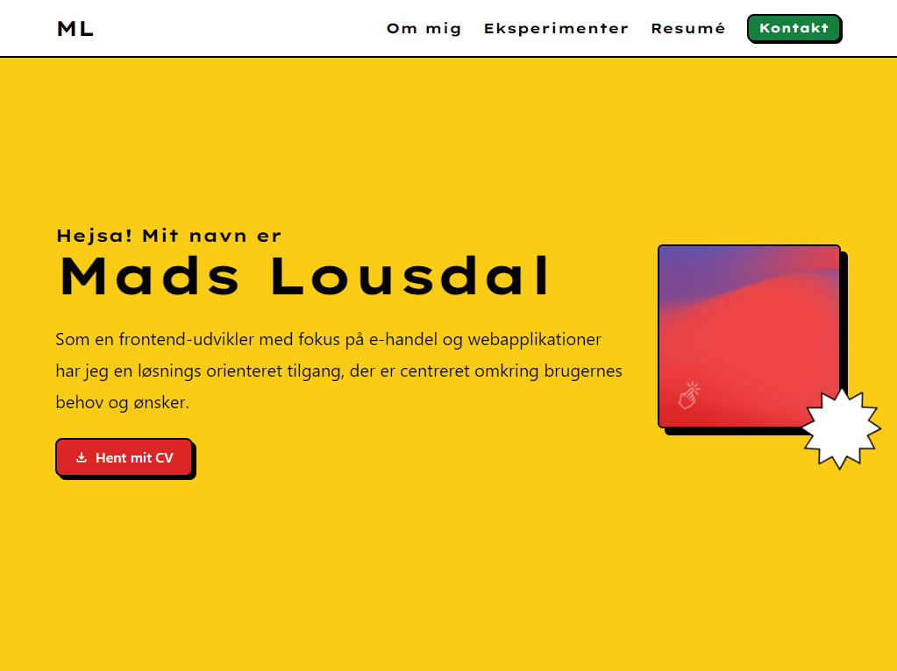

# 🖼️ Portfolio

Welcome to my web portfolio! This project showcases my skills, projects, and experience as a web developer. Whether you're a potential employer, collaborator, or just curious about my work, you'll find all the information you need here.

## 👨‍💻 Technologies used

- Astro
- Figma
- TailwindCss
- Vercel (for hosting)

## 📸 Screenshots

## 🧞 Commands

All commands are run from the root of the project, from a terminal:

| Command                   | Action                                           |
| :------------------------ | :----------------------------------------------- |
| `npm install`             | Installs dependencies                            |
| `npm run dev`             | Starts local dev server at `localhost:3000`      |
| `npm run build`           | Build your production site to `./dist/`          |
| `npm run preview`         | Preview your build locally, before deploying     |
| `npm run astro ...`       | Run CLI commands like `astro add`, `astro check` |
| `npm run astro -- --help` | Get help using the Astro CLI                     |
